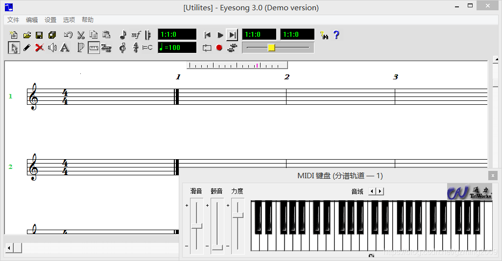
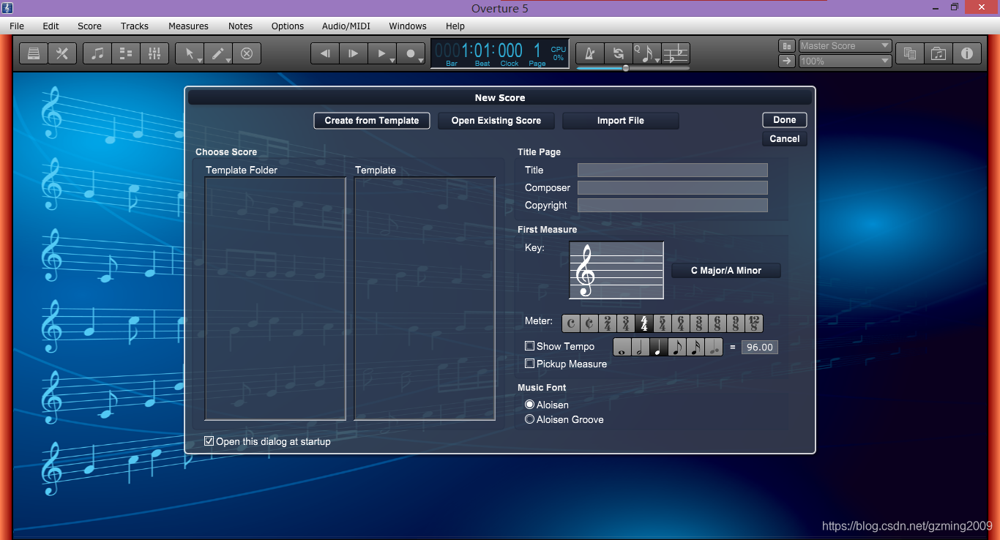

## 简介

三款老旧的打谱软件，低配电脑可用。**本工程主要学习如何进行软件打包。**

## Eyesong

作为一款远古时期的五线谱简谱软件，竟然能在Win10上正常使用。必然应该分享一波。

## 0verture5和Gu1tar Pro6

主要借这两个软件学习一下如何进行Inno Setup软件打包。

软件打包技术分享：[【打包教程】0vertrue/Gu1tar Pro6软件打包技术分享](https://ybcq.github.io/2019/03/01/%E3%80%90%E6%89%93%E5%8C%85%E6%95%99%E7%A8%8B%E3%80%910verture5%20Gu1tar%20Pro6%E8%BD%AF%E4%BB%B6%E6%89%93%E5%8C%85%E6%8A%80%E6%9C%AF%E5%88%86%E4%BA%AB/)

